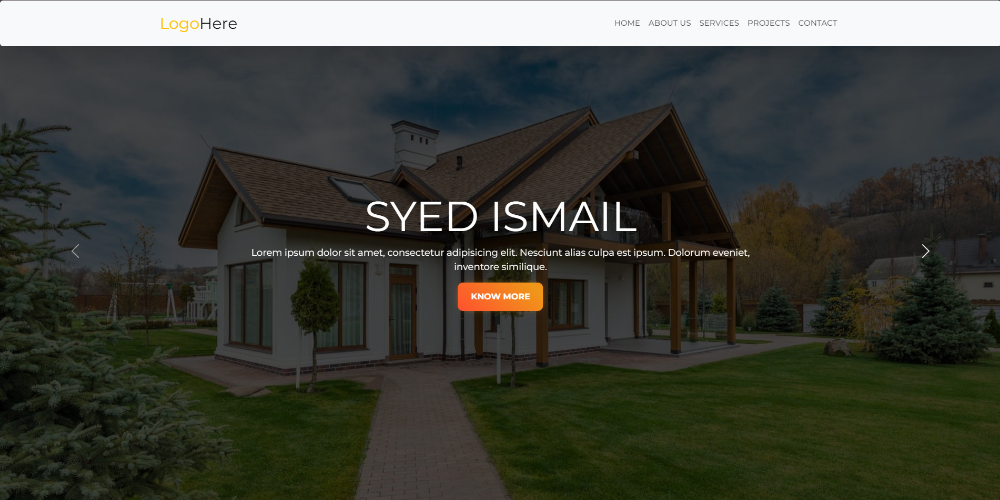

# Real Estate - Syed Ismail

Welcome to the "Bootstrap - Syed Ismail" project! This project is a personal website built using HTML, CSS, and Bootstrap, along with some additional libraries for animations and styling.

## Project Structure
The project consists of the following sections:

1. **Header**: Contains a navigation bar with links to different sections of the page.
2. **Hero Section**: A carousel showcasing images with accompanying text.
3. **About Us**: A section providing information about the website or the person.
4. **Services**: A section listing the services offered.
5. **Portfolio**: A section displaying projects.
6. **Team**: A section introducing team members.
7. **Contact**: A form for visitors to get in touch.
8. **Footer**: A simple footer with a copyright notice.

## Dependencies

This project uses the following external resources:

- **Bootstrap**: For responsive layout and styling.
- **Google Fonts**: For custom fonts.
- **Animate.css**: For CSS animations.
- **Font Awesome**: For social media icons.
- **WOW.js**: For triggering animations on scroll.

## File Structure

The project includes the following files:

- `index.html`: The main HTML file containing the structure of the website.
- `style.css`: Custom CSS file for additional styling.
- `script.js`: JavaScript file for any additional functionality.
- Images: A folder containing images used in the website.

## Getting Started

To view the project locally, follow these steps:

1. Clone the repository:
    ```bash
    git clone https://github.com/your-repo/realestate.git
    ```
2. Open the `index.html` file in your browser.

## Sections Description

### Header

The header includes a navigation bar that sticks to the top of the page. It contains links to the Home, About Us, Services, Projects, and Contact sections.

### Hero Section

This section features a carousel with images and text. Each slide has a "Know More" button.

### About Us

The About Us section includes an image and some descriptive text about the website or the person.

### Services

The Services section lists three services with icons, descriptions, and "Learn More" buttons.

### Portfolio

This section showcases projects with images, titles, descriptions, and "View Details" buttons.

### Team

The Team section introduces team members with their photos, names, descriptions, and social media icons.

### Contact

The Contact section includes a form for visitors to enter their details and send a message.

### Footer

The footer contains a simple copyright notice.

## Scripts

- **Bootstrap**: For responsive design and layout.
- **WOW.js**: To initialize and manage animations.

## Customization

Feel free to customize the content, styles, and images to fit your personal or project needs. You can modify the `style.css` file for custom styles and `script.js` for additional functionality.

## License

This project is open-source and available for personal and commercial use. 

## Contact

For any queries or suggestions, please contact Syed Ismail Shah. 
Email: syedm.ismail04@gmail.com

Enjoy building your personal website!